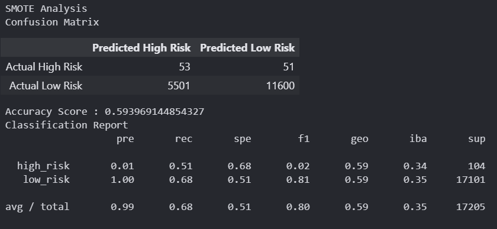

 # Credit Risk Analysis

 ## Overview of the Analysis

 During this analysis we are going to check the Card Risk using the CSV file provided using machine learning algorithms. Such as,

    - Naive Random Oversampling
    - SMOTE oversampling
    - Cluster Centroid Undersampling
    - Easy Ensemble Classifying

Between others, this way we can train our models and get results that are going to help us during the analysis. 

## Results

First we have the Oversampling analysis

- Accuracy Score: 57.7%
- Precision High Risk:  1%
- Precision Low Risk: 100%
- Recall High Risk: 43%
- Recall Low Risk: 72%

 

Then we can see the SMOTE analysis
- Accuracy Score: 59.3%
- Precision High Risk: 1%
- Precision Low Risk: 100%
- Recall High Risk: 51%
- Recall Low Risk: 68%

Here is the undersampling 

- Accuracy Score: 52.6%
- Precision High Risk: 1%
- Precision Low Risk: 99%
- Recall High Risk: 54%
- Recall Low Risk: 51%

Then the SMOTEENN analysis 

- Accuracy Score: 63.52%
- Precision High Risk: 1%
- Precision Low Risk: 100%
- Recall High Risk: 69%
- Recall Low Risk: 58%

Random Forest Analysis

- Accuracy Score: 65.3%
- Precision High Risk: 74%
- Precision Low Risk: 100%
- Recall High Risk: 31%
- Recall Low Risk: 100%

Easy Ensamble Analysis

- Accuracy Score: 87.41%
- Precision High Risk: 8%
- Precision Low Risk: 100%
- Recall High Risk: 81%
- Recall Low Risk: 94%

## Summary

When ussing a model it is important to have a recall rate pof high risk percentage and we can choose between this models, having the results, we can choose between:

- SMOTEENN analysis: 69%
- Easy Ensamble Analysis: 81%

And also it is important the accuracy percentage to kwno how well the model is going to perform.

- Easy Ensamble Analysis: 87.41%
- Random Forest Analysis: 65.3% 

Having this data of each of the Analysis I would recommend the Easy Ensamble Analysis which has the most high percentage having a good performance. 

